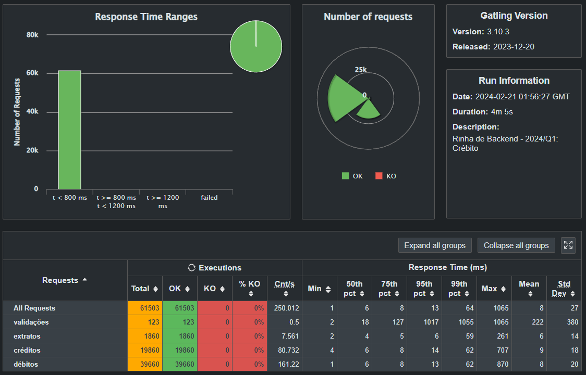

# Rinha de Backend 2024 Q1 - NestJS com Prisma

## Sobre o Projeto
Brinquei um pouco com NestJS e Prisma na rinha de backend 2024 Q1! 🔥 A ideia principal é medir o desempenho do NestJS com Prisma sem prejudicar a legibilidade do código e seguindo alguns padrões de arquitetura utilizados no dia a dia.

Lembrando que algumas tipagens não foram adicionadas por questão de tempo. Minha prioridade foi fazer funcionar e obter o desempenho.

## Resultados

[Repositório da rinha](https://github.com/zanfranceschi/rinha-de-backend-2024-q1)